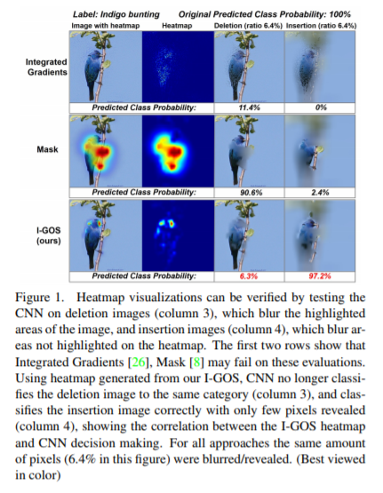

# Overview 

Original Paper: [Visualizing Deep Networks by Optimizing with Integrated Gradients](https://arxiv.org/abs/1905.00954)

# Visualizing Deep Networks by Optimizing with Integrated Gradients

- Heatmaps are not all equals, the way they correlate to the actual processing is important 

- Good correlation is fundamental to understand what the strong features, automatically learned by the CNN, are so to be able to debug the NN

Work in progress 

