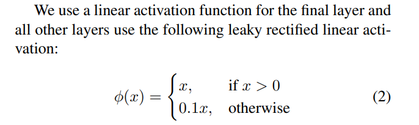

# Overview 

YOLO v1.0 

Paper: [You Only Look Once: Unified, Real-Time Object Detection](https://arxiv.org/abs/1506.02640)

# Architecture 

Structure: 

Block 1: ConvBlocks 

- Set of Convolutional Layers 

Block 2_ Dense Layers 

- 2 x Dense hence Fully Connected Layers 

Definition of components, assuming Pytorch 

- [nn.Conv2d](https://pytorch.org/docs/stable/generated/torch.nn.Conv2d.html)
- [nn.MaxPool2d](https://pytorch.org/docs/master/generated/torch.nn.MaxPool2d.html)
- [nn.LeakyReLU](https://pytorch.org/docs/master/generated/torch.nn.LeakyReLU.html)

## Block 1 - ConvLayers 

### Activations 

In the ConvBlock the activations are all leaky relus, from the paper 

### Subblock 1 

| From the Picture | Pytorch | Comment | 
| --- | --- | --- |
| Input 448x448x3 |  |  | 
| > Conv. Layer, 7x7x64-s-2 | `nn.Conv2d(in_channels=3, out_channels=64, kernel_size=7, stride=2, padding=3)` | Padding=3 is needed as the MaxPool2d 2x2-s2 will make `W'=W/4` and `H'=H/4`   Considering `W'=112` and `H'=112` then `W=448` and `H=448` after the Convolution hence a proper padding to preserve the input WxH is needed which is given by `P=K//2` (floor division) with `P` Padding and `K` Conv Kernel Size |
| > LeakyRELU 0.1 | `nn.LeakyReLU(negative_slope=0.1)` | See above | 
| > Maxpool Layer 2x2-s-2 | `nn.MaxPool2d(kernel_size=2, stride=2)` |  | 

Work in progress 

