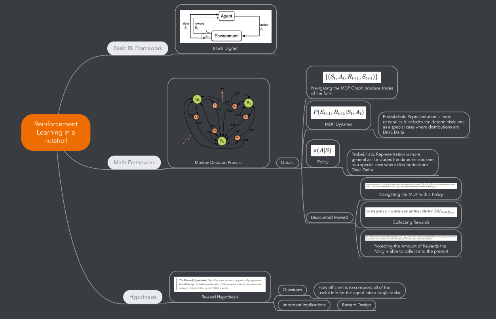

# Overview 

Reinforcement Learning Papers Review

# RL in a Nutshell 

[Reinforcement_Learning_in_a_nutshell.pdf](Reinforcement_Learning_in_a_nutshell.pdf)
- **NOTE**: Zoom on the specific regions to read them

# Papers 

## Reinforcement Learning, fast and slow 

- [Reinforcement Learning, Fast and Slow - Collaborative Work](https://docs.google.com/document/d/18-EXd6uKowrT3wiTzR6ZUk6CbP6DRyokLYaRlXu97Q0/edit?usp=sharing)
  - I prefer to share a Google Doc so to be able to allow willing contributors to directly comment on it 
  - Updates 
  
### 20191112 

- Updated [Collaborative Analysis Doc](https://docs.google.com/document/d/18-EXd6uKowrT3wiTzR6ZUk6CbP6DRyokLYaRlXu97Q0/edit?usp=sharing) with [Episodic Memory Update](https://docs.google.com/document/d/18-EXd6uKowrT3wiTzR6ZUk6CbP6DRyokLYaRlXu97Q0/edit#bookmark=id.l7vex12jksyu)
 
### 20191110 

- Updated [Reasons why Gradient Based Methods are slow](https://github.com/NicolaBernini/PapersAnalysis/issues/20#issuecomment-501283824)

### 20191109 

- Content Update [here](https://github.com/NicolaBernini/PapersAnalysis/issues/20#issuecomment-501279383)

